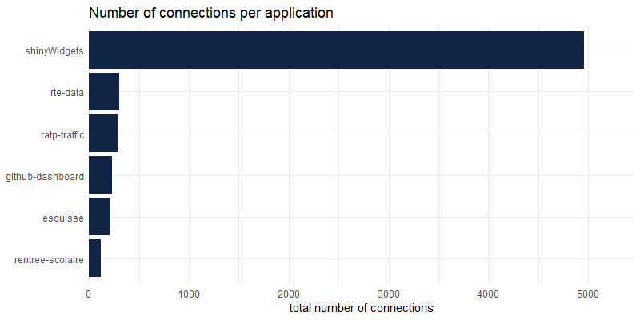
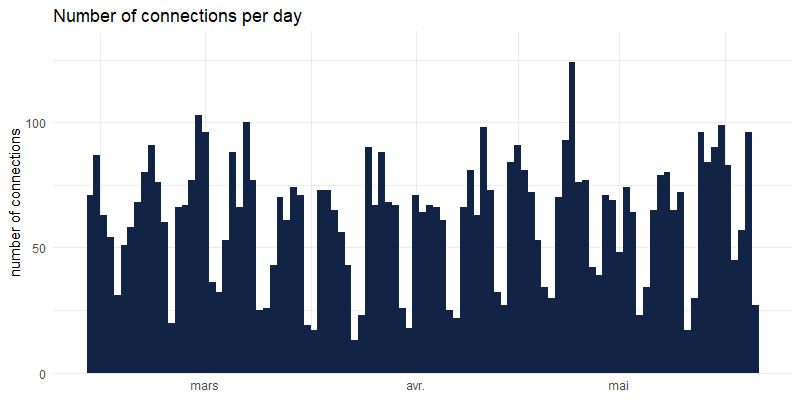
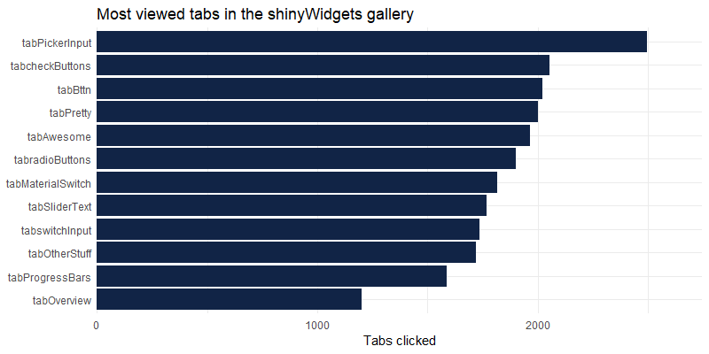
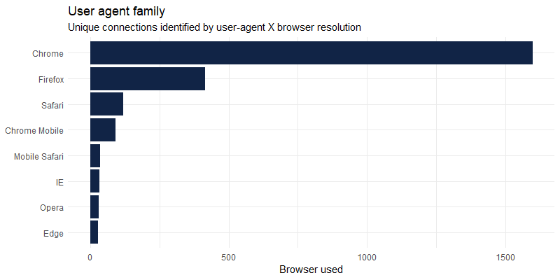
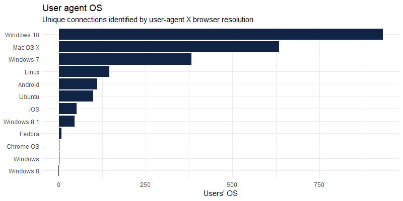

<!-- README.md is generated from README.Rmd. Please edit that file -->

```{r, include = FALSE}
knitr::opts_chunk$set(
  collapse = TRUE,
  comment = "#>",
  fig.path = "man/figures/README-",
  out.width = "100%"
)
```

# shinylogs

> Logging tool for Shiny applications: record inputs or outputs changes, and infos about user's session. All recording is done client-side to not slow down the application and occupy the server.

<!-- badges: start -->
[](https://CRAN.R-project.org/package=shinylogs)
[](https://cranchecks.info/pkgs/shinylogs)
[](https://lifecycle.r-lib.org/articles/stages.html)
[](https://www.repostatus.org/#active)
[](https://app.codecov.io/gh/dreamRs/shinylogs?branch=master)
[](https://github.com/dreamRs/shinylogs/actions)
<!-- badges: end -->


## Installation

You can install the released version of shinylogs from [CRAN](https://CRAN.R-project.org/package=shinylogs) with:

```r
install.packages("shinylogs")
```

And the development version from [GitHub](https://github.com/dreamRs/shinylogs) with:

```r
# install.packages("remotes")
remotes::install_github("dreamRs/shinylogs")
```


## Usage

Call the main function `track_usage` in server part of application, and specify where to write logs:

```{r example, eval=FALSE}
library(shinylogs)

track_usage(storage_mode = store_json(path = "logs/"))
```

The function will record : 

* *inputs* : each time an input change, name, timestamp and value will be saved
* *errors* : errors propagated through outputs
* *outputs* : each time an output is re-generated
* *session* : informations about user's browser and the application

See the vignette for more details (` ?vignette("shinylogs")`) or the [online version](https://dreamrs.github.io/shinylogs/articles/shinylogs.html).


## Examples

Some example of what is recorded with logs from applications available on our Shiny-Server: http://shinyapps.dreamrs.fr/


Number of connections per applications:

```{r, echo=FALSE}

```


Number of connections over time :

```{r, echo=FALSE}

```


Which tabs (from sidebar in {shinydashboard}) in [shinyWidgets](https://github.com/dreamRs/shinyWidgets) gallery are the most seen : 

```{r, echo=FALSE}

```


User-agent is recorded per connection and can be parsed with [uaparserjs](https://github.com/hrbrmstr/uaparserjs) :
(unique users are not registered as we use the open source version of shiny-server)

```{r, echo=FALSE}


```


## Development

This package use [{packer}](https://github.com/JohnCoene/packer) to manage JavaScript assets, see packer's [documentation](https://packer.john-coene.com/#/) for more.

Install nodes modules with:

```r
packer::npm_install()
```

Modify `srcjs/exts/shinylogs.js`, then run:

```r
packer::bundle()
```

Re-install R package and try `track_usage()` function.
